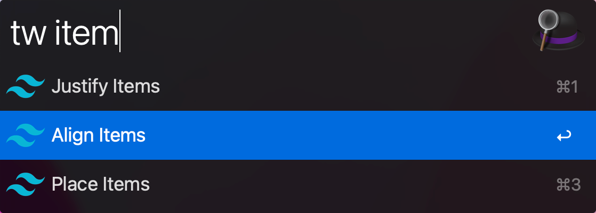
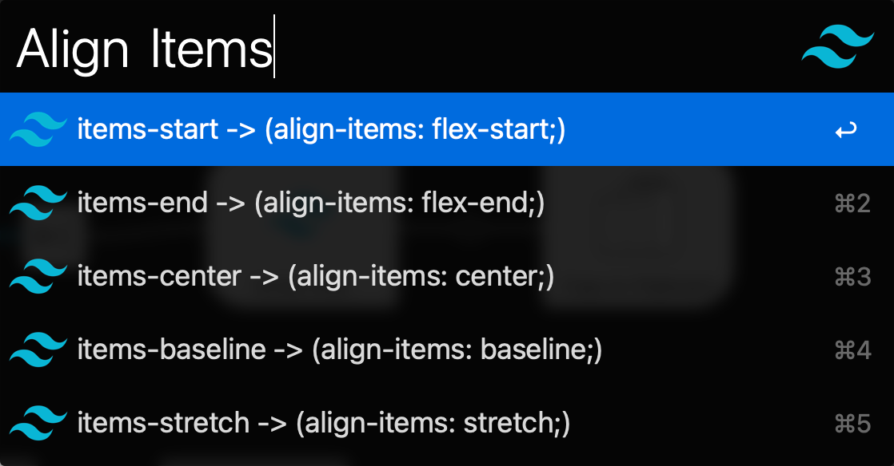

# TailwindEasyFindClassname





## 使用 

在 Alfred 中，输入 `tw` 关键字，回车或者空格后，输入需要查询的 style 样式 key（比如 `margin`、`pad`（模糊搜索）等），返回列表。回车选择需要查询的样式 key，此时返回 tailwind 中关于该样式的可用类名列表，此时可以再次输入关键字进行模糊查询，回车复制最终类名

另外需要直接 open 文档的话，可在第一次关键字查询后，用 `cmd+option+enter` 打开 tailwind 中的文档（这里不知道为啥直接用 cmd 当作 Action Modifier 不生效）

## 使用 issue

* 因为仅个人使用，懒得导出了，可以直接 clone 到具体存放 workflow 的文件夹中进行使用
* 运行脚本需要修改成自己的 node 所在位置
* 这里并不是全部数据，只是自己需要的数据，如果需要添加其他数据，可参考 [开发背景](https://github.com/lessfish/alfred-TailwindEasyFindClassname#%E5%BC%80%E5%8F%91%E8%83%8C%E6%99%AF) 进行补充

## 开发背景

最近在使用 tailwind，但是一些类名经常会忘记，需要去翻阅文档，于是就有了做个常用类名查询的 workflow 的想法（市面上有一些根据查询样式打开文档的 workflow，但是我想进一步能根据样式查询可用样式列表，做到 docless）

tailwind 能表示的样式列表都在 [文档](https://tailwindcss.com/docs/installation) 左侧，我们先把他们拿到：

```js
// 打开 devtools
// 这里需要注意，active menu 的 className 有差异，所以提取不到 active menu 的数据，所以需要在 active menu 是不需要的数据的页面进行提取
// 比如在这个页面 https://tailwindcss.com/docs/installation
const ans = [...document.getElementsByClassName('block border-l pl-4 -ml-px border-transparent hover:border-slate-400 dark:hover:border-slate-500 text-slate-700 hover:text-slate-900 dark:text-slate-400 dark:hover:text-slate-300')].map(item => ({ href: item.href, name: item.innerText}))
```

但是这会把侧边所有菜单的数据都捞下来，很显然有些并不是样式列表数据，需要剔除，另外又根据个人需求，筛选了一些个人需要的样式，汇总在 [menu.json](menu.json) 文件中

然后需要把这些样式对应的 tailwind 样式列表抓下来，之前比较习惯用 superAgent，但是现在 chrome 支持了﹝Copy as Node.js fetch﹞，感觉用 node-fetch 会更加省事了。详见 [curl_all.js](curl_all.js)，运行后数据会保存到 [class-list.json](class-list.json)

接下去就是 Alfred Workflow 的开发了
